# Painel Macroeconômico - Processo ETL

Plataforma de dados para análise de indicadores macroeconômicos do Brasil, construída com um pipeline de dados assíncrono e um dashboard interativo

## 📋 Descrição
Este projeto implementa uma solução completa de dados, consistindo em:

1. **Backend ETL (Java/Spring Boot):** Processo que realiza a captura, transformação e persistência de séries temporais da API de Dados Abertos do Banco Central do Brasil (BCB).

2. **Frontend (Python/Streamlit):** Um dashboard analítico que consome os dados processados pelo backend para exibir visualizações interativas.

 O sistema utiliza uma arquitetura com as seguintes capacidades:

- **Captura Assíncrona:** Tarefas agendadas buscam novos dados sem intervenção manual.

- **Comunicação Desacoplada:** Utiliza RabbitMQ como message broker para garantir que a captura e o processamento de dados sejam independentes.

- **Transformação de Valor Agregado:** Não apenas move dados, mas calcula e armazena **agregações pré-calculadas** (mensais e anuais) para otimizar a performance de dashboards.

- **Persistência:** Salva os dados brutos e agregados em um banco de dados PostgreSQL.

## 🏗️ Estrutura do Repositório
Este é um monorepo que contém tanto o backend quanto o frontend:
```
/
├── painel-macroeconomico/ # Pasta do Backend (Java/Spring Boot)
├── frontend/              # Pasta do Frontend (Python/Streamlit)
└── README.md
```

### ⚙️ Backend (Java / Spring Boot)

Agendadores (`service/agendador`): Ponto de entrada do sistema, dispara os processos de captura e agregação em horários pré-definidos.

- **Cliente de API (`service/client`):** Camada responsável por toda a comunicação com a API externa do Banco Central.

- **Publicador (`service/PublisherService`):** Orquestra a busca de dados (usando o Cliente de API) e publica cada registro individualmente na fila do RabbitMQ.

- **Consumidor (`service/ConsumerService`):** Escuta a fila do RabbitMQ, recebe os dados brutos e os persiste na tabela principal de indicadores.

- **Serviço de Agregação (`service/AgregacaoService`):** Contém a lógica de negócio para calcular as agregações mensais e anuais a partir dos dados brutos.

- **Repositórios (`repository`):** Camada de acesso aos dados, utilizando Spring Data JPA para interagir com o banco PostgreSQL.

### 📊 Frontend (Python / Streamlit)
O frontend é uma aplicação web construída com Streamlit que consome os dados pré-agregados pelo backend para fornecer uma experiência de visualização rápida e interativa.

- **Tecnologias:** Python, Streamlit, Supabase-py, Pandas, Plotly.

- **Fonte de Dados:** Conecta-se diretamente ao banco de dados PostgreSQL para ler as tabelas indicador_agregado_mensal e indicador_agregado_anual.


## 🚀 Como Executar
### Pré-requisitos
- Java 21 e Maven 3.6+ (para o backend)
 - Python 3.9+ e Pip (para o frontend)
Um arquivo application.properties devidamente configurado.

### Configuração

#### Backend (Java)
Antes de executar, você precisa configurar as credenciais de acesso ao RabbitMQ e ao PostgreSQL. Crie o arquivo `src/main/resources/application.properties` e adicione as seguintes chaves com seus respectivos valores:

```bash
# Configuração do Banco de Dados (PostgreSQL)
spring.datasource.url=jdbc:postgresql://<HOST>:<PORT>/<DATABASE>
spring.datasource.username=<USER>
spring.datasource.password=<PASSWORD>
spring.jpa.properties.hibernate.default_schema=test

# Configuração do RabbitMQ
spring.rabbitmq.host=<HOST>
spring.rabbitmq.port=5672
spring.rabbitmq.username=<USER>
spring.rabbitmq.password=<PASSWORD>

# Outras configurações JPA
spring.jpa.hibernate.ddl-auto=update
spring.jpa.show-sql=true
```
#### Frontend (Python) 


### Execução
#### Terminal 1: Executando o Backend
Com as configurações prontas, execute a aplicação com o seguinte comando Maven:
```
cd painel-macroeconomico
mvn clean install
mvn spring-boot:run
```
A aplicação irá iniciar, e os processos agendados serão executados nos horários definidos.

#### Terminal 2: Executando o Frontend
```
cd front-end-py
pip install -r requirements.txt
streamlit run front.py

```

## Executar com Docker Compose
Se preferir, você pode subir tudo com Docker Compose (aplicação, banco e RabbitMQ) usando os perfis definidos no compose.

#### Pré-requisitos
Docker Desktop instalado e em execução.

#### Passos
1) Entre na pasta do backend:
 ```
cd painel-macroeconomico
```


3) Revise o arquivo .env desta pasta e ajuste conforme necessário. Ele já contém valores padrão de desenvolvimento, por exemplo:
```
#Spring profile
SPRING_PROFILES_ACTIVE=dev

#Database (PostgreSQL)
SPRING_DATASOURCE_URL=jdbc:postgresql://db:5432/appdb
SPRING_DATASOURCE_USERNAME=appuser
SPRING_DATASOURCE_PASSWORD=apppassword
POSTGRES_DB=appdb
POSTGRES_USER=appuser
POSTGRES_PASSWORD=apppassword

#RabbitMQ
SPRING_RABBITMQ_HOST=rabbitmq
SPRING_RABBITMQ_PORT=5672
SPRING_RABBITMQ_USERNAME=guest
SPRING_RABBITMQ_PASSWORD=guest

#Supabase (dummy defaults)
SUPABASE_URL=http://localhost/
SUPABASE_SERVICE_KEY=test-key
SUPABASE_BUCKET=test
```

3) Subir o ambiente de desenvolvimento (perfil dev):
```
docker compose --profile dev up -d
```
Caso esteja usando a CLI antiga, você pode usar:
```
docker-compose --profile dev up -d
```

4) (Opcional) Forçar rebuild das imagens ao subir:
```
docker compose --profile dev up -d --build
```


6) Verificar serviços:
```
docker compose ps
```


8) Acompanhar logs da aplicação:
```
docker compose logs -f app
```


#### Acessos
Aplicação (Spring Boot): http://localhost:8080
PostgreSQL: localhost:5432
RabbitMQ Management: http://localhost:15672 (usuário guest, senha guest por padrão)

#### Encerrar
Parar e remover os serviços do perfil dev:
```
docker compose --profile dev down
```

Parar e remover também os volumes (apaga dados do banco):
```
docker compose --profile dev down -v
```

#### Perfis disponíveis
dev: sobe app, db (PostgreSQL) e rabbitmq com portas expostas.
test: sobe app-test em http://localhost:8081.
prod: semelhante ao dev; ajuste o .env para credenciais e variáveis de produção.

## 📊 Diagramas (UML e IDEF0)


### Diagrama de Classes


### Diagrama de Sequência 

## 💾 Persistência de Dados
Os dados são armazenados em um banco de dados PostgreSQL, divididos em três tabelas principais p:

- `indicador_economico:` A tabela de fatos, armazena todos os registros brutos e diários capturados da API do BCB.

- `indicador_agregado_mensal:` Tabela de sumário com dados pré-agregados por mês (valor médio, máximo e mínimo).

- `indicador_agregado_anual:` Tabela de sumário com dados pré-agregados por ano.

Essa estrutura permite que o frontend faça consultas extremamente rápidas aos dados já consolidados, em vez de processar milhares de registros a cada requisição.

Exemplo de dado em `indicador_agregado_anual:`
```
| id | codigo_bc | ano  | valor_medio | valor_maximo | valor_minimo |
|----|-----------|------|-------------|--------------|--------------|
| 1  | 10813     | 2024 | 5.1523      | 5.4510       | 4.8970       |
```
